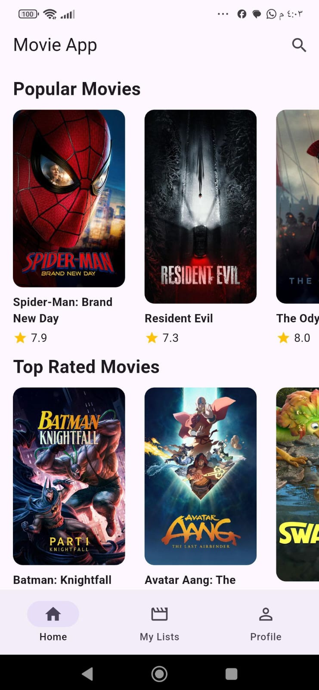
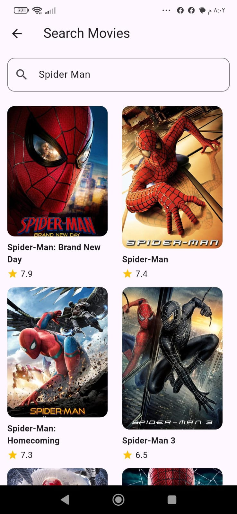
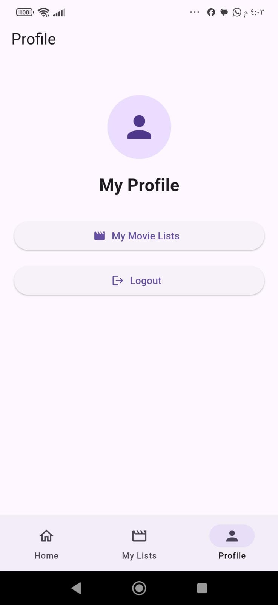

# 🎬 Movie App

A Flutter movie application that allows users to browse movies, search for movies, view movie details, and organize movies into personal lists.

## ✨ Features

* Browse Popular Movies
* Browse Top Rated Movies
* Browse Now Playing Movies
* Browse Upcoming Movies
* Search for Movies
* View Movie Details
* Firebase Authentication
* Register and Login
* Persistent User Session
* Logout
* Store User Data in Firestore
* Add Movies to Personal Lists
* Remove Movies from Personal Lists
* Favorites
* Watched
* Watching
* Want to Watch
* Splash Screen
* Bottom Navigation

## 🛠️ Technologies

* Flutter
* Dart
* BLoC / Cubit
* Dio
* TMDB API
* Firebase Authentication
* Cloud Firestore
* flutter_dotenv
* Cached Network Image

## 🏗️ Architecture

The project is organized using a layered structure:

```text
lib/
├── models/
├── views/
├── controllers/
├── services/
├── widgets/
└── main.dart
```

## 📱 Main Screens

### Home

Browse different movie categories including Popular, Top Rated, Now Playing, and Upcoming movies.

### Search

Search for movies using the TMDB API.

### Movie Details

View the movie poster, backdrop, title, rating, release date, overview, and add the movie to a personal list.

### My Movie Lists

Manage personal movie lists:

* Favorites
* Watched
* Watching
* Want to Watch

### Profile

View the profile section, open personal movie lists, and log out.

## 🔥 Firebase

Firebase Authentication is used for user registration, login, session handling, and logout.

Cloud Firestore is used to store user information and personal movie lists.

## 🌐 API

Movie data is provided by the TMDB API.

TMDB API:
https://www.themoviedb.org/documentation/api

## 📸 Screenshots

<p align="center"> 
 
 
 
</p>

## 🎥 Demo

[▶️ Watch the Movie App Demo](https://youtu.be/yNoxr7R2JvM?si=atAdKJwfy4M_C04E)

## 🚀 Getting Started

1. Clone the repository.
2. Run:

```bash
flutter pub get
```

3. Create a `.env` file and add your TMDB API key:

```env
TMDB_API_KEY=YOUR_API_KEY
```

4. Configure Firebase for the Android application.
5. Run:

```bash
flutter run
```

## 👨‍💻 Author

Ziyad Bohdor
